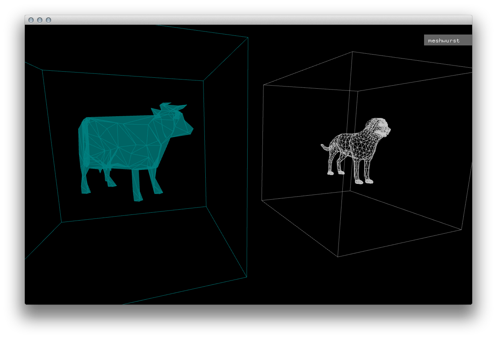

This competition gives me a brilliant excuse to work on a little artifact that I've been toying with for about three years now. It bears the ominous title __Meshwurst__ and goes as follows:

> __Meshwurst__ is a tool, which allows you to take any 3D model and turn it into digital waste through a simple, spatially organised interface. Each result is unique and can be exported and - if desired - sent to a 3D printer.

Leaving everything a little too late (as per usual), I have about five days left to do this. I've decided upfront that I will be using [openFrameworks](http://www.openframeworks.cc), as I desperately need more experience writing _C++_.

Now regarding the competition rules, I figured that the [3D Warehouse](https://3dwarehouse.sketchup.com/) would be a good place to query for models, although I'm not sure whether they have a public API, neither can I say without any doubt that __SketchUo__ can still be considered a __Google__ product as they seemed to have removed any branding from their website.

If that doesn't count, I reckoned, I could always use __Google Drive__ to upload the resulting mes(s/h)es to. Unfortunately, at this point I cannot tell whether interfacing with either API from __openFrameworks__ is achievable or not but hey, where'd be the challenge?

## Progress recap at the end of day #1

- Basic project setup
- Loaded cow and dog models (.skp exported as .3ds) into scene
- Beginning of a navigation (ability to select items using key presses)

## Next steps

- Model mesh grinder
- Animate mesh grinder
- Write actual _jumble algorithm_
- Stack results at the bottom of the application
- Write camera component that can move gradually from A to B