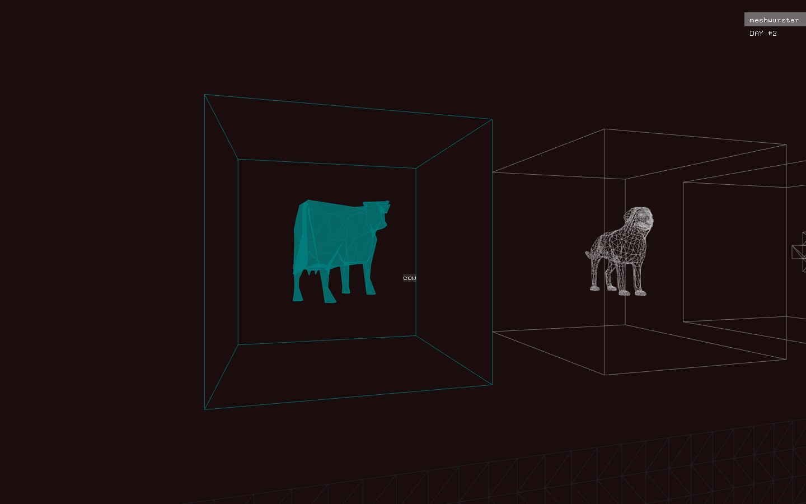
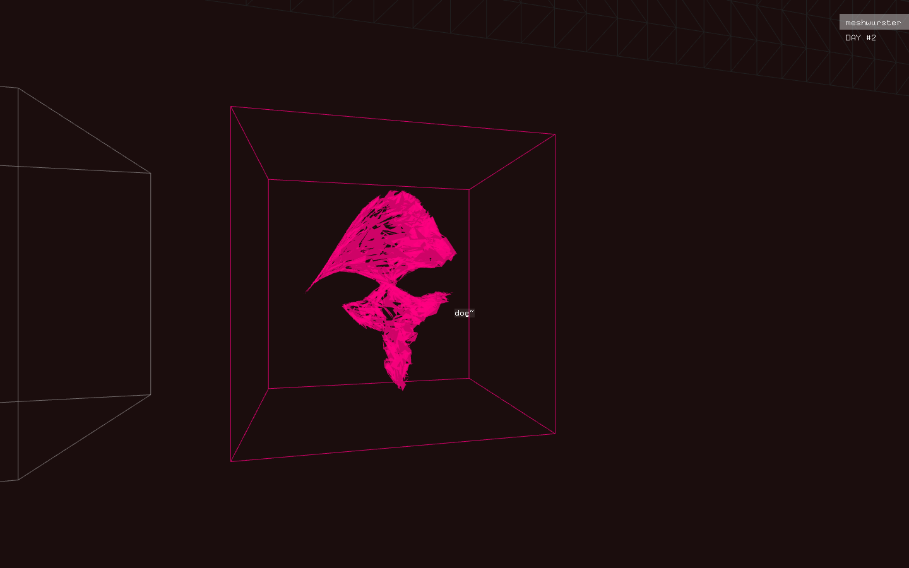

I've made some good progress today, so good in fact, I might even find the time to do some sketches tomorrow. The colour palette has seen some refinements, we have a camera that can go places on key presses and albeit the weird issues I'm experiencing with scaling and orientation of meshes extracted from models, you can turn stuff into polygon salad.

I will start including links to builds on here from now on. If you happen to run at least _Mac OS X Mountain Lion_, you may have a look [here](https://www.dropbox.com/s/2jvv9i9i02r04x7/meshwurst_osx.zip) (6.2mb, .zip). Source will follow shortly.

A few things worth noting:

- Press 'F' to toggle fullscreen mode
- Use the arrow keys to navigate
- 'SPACE' to perform an action on the selected container

## Progress recap at the end of day #2

- Continued work on aesthetic 
- Written actual _jumble algorithm_
- Made results stack at the bottom of the application
- Wrote camera component that can move gradually from A to B

Caution, may contain memory leaks.. Still haven't got a clue whether I will be able to use either _Google_ technology in combination with the __openFrameworks__ app. Let's see what tomorrow brings.

## Next steps

- Documentation! (Sketches!)
- Improve jumble algorithm to produce workable geometry
- (Write vertex shader for temporary grinder)
- Resolve issues with display of meshes (scaling)
- Write transition animation