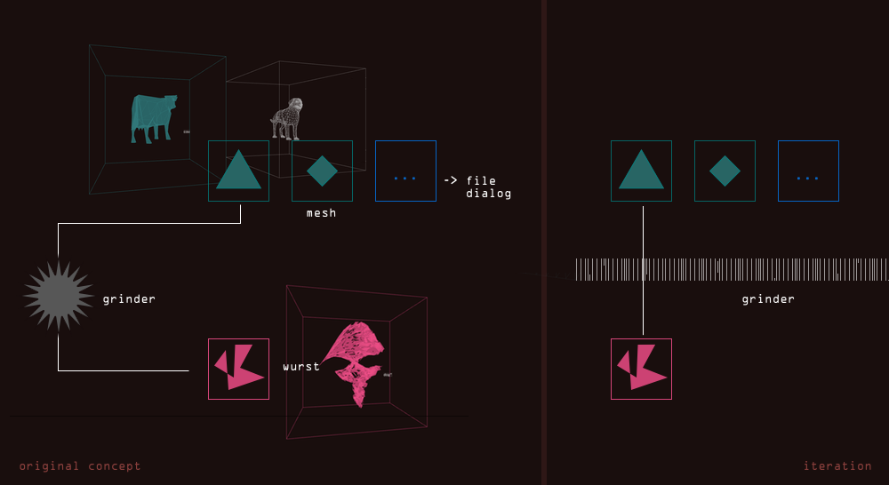

I am still not entirely sure what was going through my mind when I first thought of the concept for __Meshwurst__. What has definitely always been part of the idea was the meat grinder, happily churning away, spitting out triangles.

Due to the short time window and me underestimating the time it takes to write a proper grinding algorithm however, the grinder has been replaced by a barrier in the latest iteration.

The camera will still follow the model on its journey, however the barrier will take on a solid colour, to censor what's really going on. I've come to like the slightly clayish background colour, it's slightly unsetttling.

For __Meshwurst__ to be made into a gallery installation, it would require some sort of giant lever and push button interface. It should feel really satifying to "lower" the datameat into oblivion.
