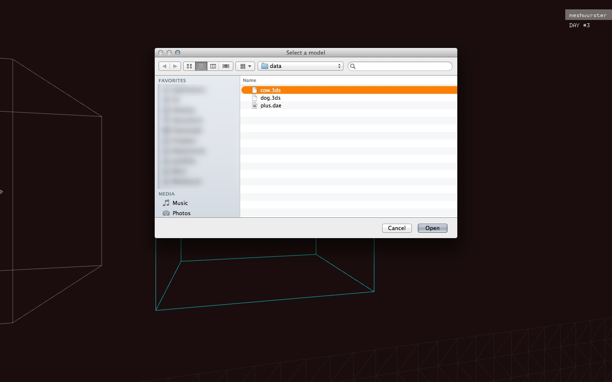
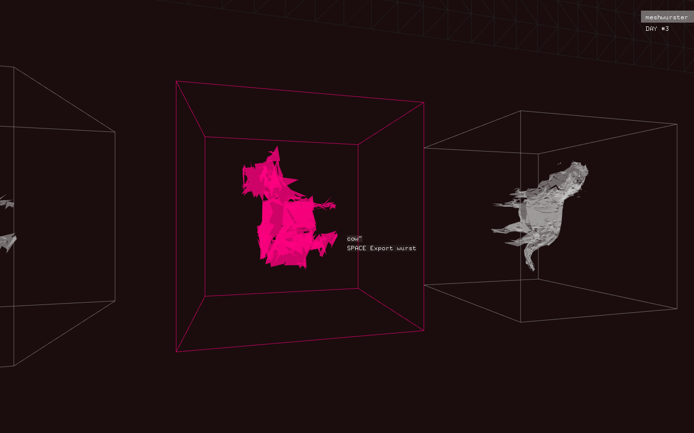

I wish I had tried implementing this file dialog earlier as it appears to be broken in the version of __openFrameworks__ that I'm using (0.8.0 on Mac OS X 10.9). Note to self: try to get access to the nightly build and run another test. 

## Process recap at the end of day #3

- Encountered bugs and entered a world of pain
- Made a sketch to better illustrate the concept
- Have camera move down to result immediately after wursting
- Refactoring

## Left to do

- Pretty much everything :/